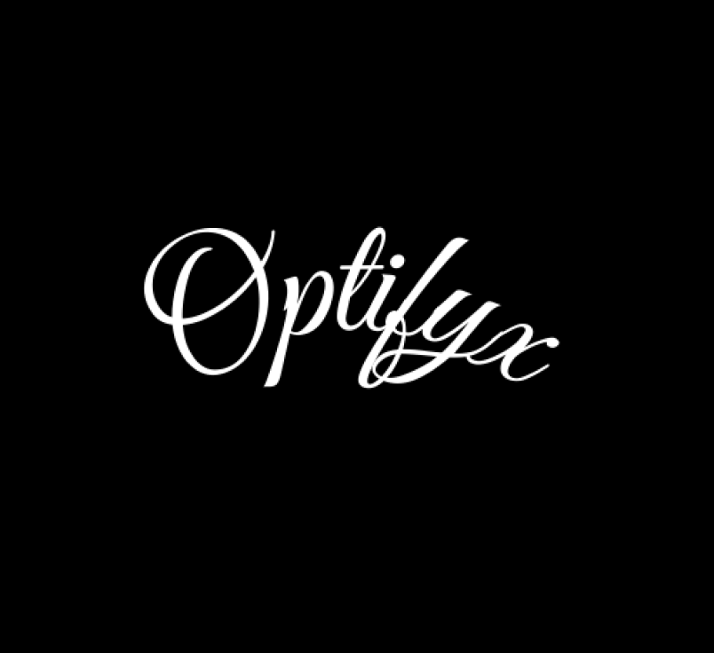

# Optifyx Server

Optifyx Server is a Python-based application designed to run as a system tray utility with a graphical interface and background server functionality. It leverages libraries such as `pystray`, `tkinter`, and `plyer` to provide a user-friendly system tray experience and notification system.



## Features

- **System Tray Integration:** Runs in the Windows system tray with an icon and menu.
- **Background Server:** Launches a background server process via `src/internal.py`.
- **GUI Window:** Displays a startup window with the Optifyx branding.
- **Startup Integration:** Automatically adds itself to Windows startup for persistent availability.
- **Notifications:** Uses desktop notifications for events like server shutdown.
- **Easy Exit:** Option to gracefully exit the application from the tray menu.

## Directory Structure

```
.
├── .github/           # GitHub configuration and workflows
├── Assets/            # Contains images/icons for the application
│   ├── image.ico
│   └── image.png
├── src/
│   ├── api/           # API-related code
│   ├── core/          # Core application logic
│   ├── internal.py    # Main server logic (imported by app.py)
│   ├── middleware/    # Middleware components
│   └── models/        # Data models
├── tests/
│   └── endpoints.py   # Test cases for API endpoints
├── app.py             # Main application entry point
├── requirements.txt   # Python dependencies
├── CONTRIBUTING.md    # Contribution guidelines
├── LICENSE            # License information
├── SECURITY.md        # Security policy
```

## Getting Started

### Prerequisites

- Python 3.8+
- Windows OS (for startup and tray features)
- Recommended: Virtual environment

### Installation

1. **Clone the repository:**
   ```sh
   git clone https://github.com/Optifyx/optifyx-server.git
   cd optifyx-server
   ```

2. **Install dependencies:**
   ```sh
   pip install -r requirements.txt
   ```

3. **Run the application:**
   ```sh
   python app.py
   ```

   The application window will appear briefly, then the server will run in the background and a tray icon will be placed in your system tray.

### Running Tests

To run the tests:
```sh
python -m unittest discover tests
```

## Contributing

See [CONTRIBUTING.md](CONTRIBUTING.md) for contribution guidelines.

## Security

For security policies and how to report vulnerabilities, see [SECURITY.md](SECURITY.md).

## License

This project is licensed under the terms of the [LICENSE](LICENSE).

---

**Note:** Most features and logic reside in the `src/` directory. The main entry point is `app.py`, which handles startup, GUI, server, and tray integration.
